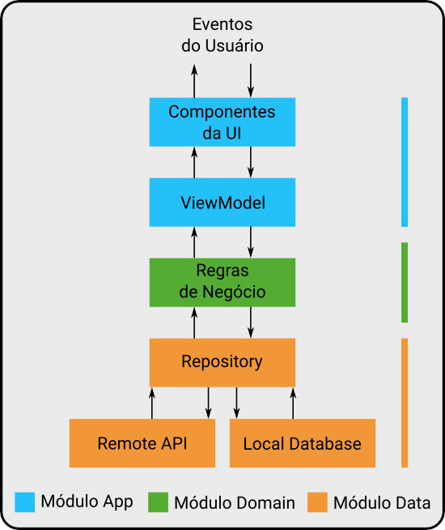

## Proposito do projeto
O objetivo deste projeto é servir de modelo de arquitetura para aplicativos Android utilizando com base a *Clean Architecture*.

### Conteúdo: 
1. [Clean Architecture](#markdown-header-clean_arch)
2. [App](#markdown-header-app_module)
3. [Domain](#domain_module)
4. [Data](#data_module)
5. [Bibliotecas](#markdown-header-libraries)

## Porque Clean Architecture
Devido a necessidade de separar o código da interface do usuário do restante do projeto bem como criar uma solução que se extenda a todo o aplicativo de modo a padronizar o desenvolvimento e facilitar testes.
O código do aplicativo é separado em 4 camadas essas camadas são representadas em 3 módulos, mesclando Entities e Services no módulo de Domain. A estrutura do projeto é então dividida em:

* módulo **app** 
* módulo **domain**
* módulo **data**
 
Para conectar tudo e gerenciar dependências, estamos usando o **Koin**.

 
#### Módulo App
Este módulo contém todo o código relacionado à camada UI / Apresentação. Isso inclui Activities, Fragments e ViewModels.
A camada de apresentação é criada usando os componentes da arquitetura do Android: ViewModels, Lifecycle e LiveData.

#### Módulo Domain
O módulo Domain é a parte principal de todo aplicativo e contém a lógica de negócios. Este módulo deve ser independente de qualquer estrutura. Pela regra de inversão de dependência, este módulo não deve depender do módulo **app** ou **data**.

#### Módulo Data
O módulo Data contém as implementações dos repositórios e outras fontes de dados, como bancos de dados ou rede.
Para armazenar dados localmente, estamos usando a Biblioteca de persistência da **Room** do Google.
Também estamos usando o **Retrofit** para solicitações de rede e o **Moshi** para analisar respostas json.
 
## Bibliotecas

 - [Retrofit](https://github.com/square/retrofit)

 - [Moshi](https://github.com/square/moshi)

 - [OkHttp](https://github.com/square/okhttp)

 - [Room](https://developer.android.com/jetpack/androidx/releases/room)

 - [Koin](https://insert-koin.io/)

 - [Kotlin Coroutines](https://kotlinlang.org/docs/reference/coroutines-overview.html)

 - [Mockk](https://github.com/mockk)

 - [Junit4](https://junit.org/junit4/)

 - [Android Architecture Components](https://developer.android.com/topic/libraries/architecture)
